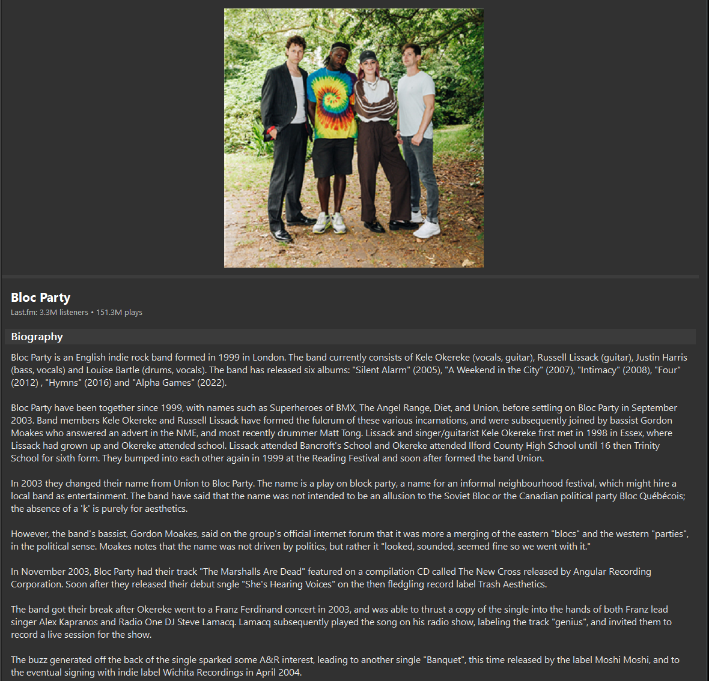
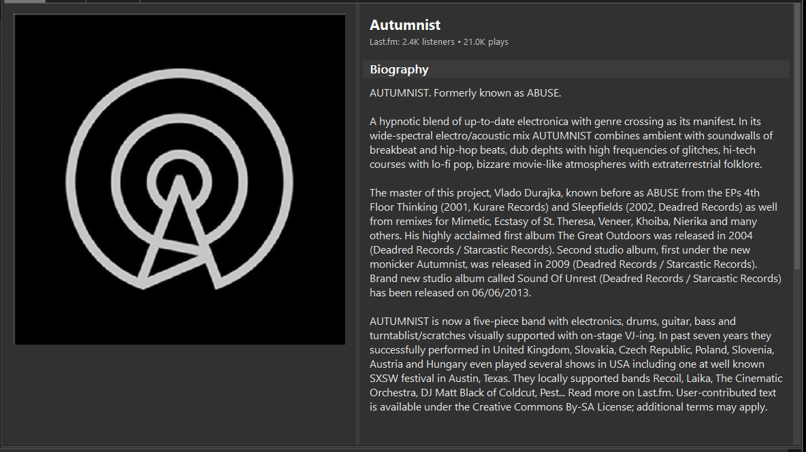

# Artist Biography Viewer for foobar2000

A comprehensive artist biography component for foobar2000 that displays artist information, images, and statistics from Last.fm and Spotify.

## Features

### 🎨 Dual Layout Modes
- **Horizontal Layout**: Image on the left, text on the right
- **Vertical Layout**: Image on top, text below
- **Draggable Dividers**: Resize image and text areas in both layouts
- **Double-click** to quickly switch between layouts

### 📝 Rich Artist Information
- High-quality artist images from Spotify and Last.fm
- Comprehensive biography with proper UTF-8 text encoding
- Artist statistics (listeners, play counts)
- Top tracks and albums
- Similar artists recommendations
- Automatic dark/light mode matching foobar2000 theme

### 🎯 User Interface
- **Right-click context menu** for layout switching
- **Layout Edit Mode support** - menu items appear in foobar2000's edit mode
- Smooth scrolling with custom scrollbar
- Responsive design that adapts to window resizing

## Screenshots

### Vertical Layout


### Horizontal Layout  


## Installation

1. Download the latest release: `foo_artist_bio_v28_EDITMODE.fb2k-component`
2. Close foobar2000 completely
3. Double-click the `.fb2k-component` file to install
4. Restart foobar2000
5. Add the "Artist Biography" panel to your layout

## Usage

### Adding to Your Layout
1. Right-click in your foobar2000 layout
2. Select "Replace UI Element" or "Add UI Element"
3. Choose "Artist Biography" from the list

### Controls
- **Double-click**: Switch between horizontal and vertical layouts
- **Right-click**: Open context menu with layout options
- **Drag divider**: Resize image/text areas
- **Mouse wheel**: Scroll through biography text

### Layout Edit Mode
When in foobar2000's layout edit mode:
- Right-click the component to see layout options in the edit menu
- Switch layouts without leaving edit mode
- Refresh artist information on demand

## Technical Details

### Version 28.0.0 Improvements
- ✅ Fixed UTF-8 text encoding issues - no more weird characters
- ✅ Perfect image scaling in both layout modes
- ✅ Draggable dividers for customizable layouts
- ✅ Layout edit mode menu integration
- ✅ Proper text rendering without cutoff
- ✅ Fixed header statistics formatting

### Requirements
- foobar2000 v2.0 or later
- Windows 10/11 (64-bit)
- Internet connection for fetching artist data

### API Integration
- **Spotify Web API**: High-resolution artist images
- **Last.fm API**: Biography, statistics, and related data
- Automatic fallback between services for maximum reliability

## Building from Source

### Prerequisites
- Visual Studio 2022 Build Tools
- foobar2000 SDK (included in repository)
- Windows SDK

### Build Instructions
```batch
cd foo_artist_view
BUILD_V28_EDITMODE.bat
```

The compiled component will be created as `foo_artist_bio_v28_EDITMODE.fb2k-component`

## Troubleshooting

### Component doesn't appear after installation
1. Ensure foobar2000 is completely closed during installation
2. Check Preferences → Components to verify installation
3. Remove any older versions of the component

### No artist information displayed
1. Ensure you're playing a track with proper artist tags
2. Check your internet connection
3. Try the "Refresh Artist Info" option from the context menu

### Text appears garbled or with strange characters
- This issue has been fixed in v28. Please update to the latest version.

## License

This component is provided as-is for use with foobar2000. 

## Credits

- Built with foobar2000 SDK 2025-03-07
- Uses Spotify Web API and Last.fm API for data retrieval
- Developed by the foobar2000 community

## Changelog

### v28.0.0 (2025-08-18)
- Added layout edit mode menu support
- Fixed edit mode context menu integration
- Improved menu handling in different modes

### v27.0.0
- Initial menu implementation attempts

### v26.0.0
- Fixed image scaling in vertical layout
- Perfect aspect ratio maintenance

### v25.0.0
- Added draggable divider in vertical layout
- Fixed header statistics formatting (removed extra commas)

### v24.0.0
- Fixed text cutoff issues
- Proper text height calculation

### v23.0.0
- Switched to DrawTextW for proper Unicode support
- Fixed UTF-8 to UTF-16 conversion

### Earlier versions
- Multiple attempts at fixing text encoding
- Basic dual layout implementation
- Initial Spotify and Last.fm integration